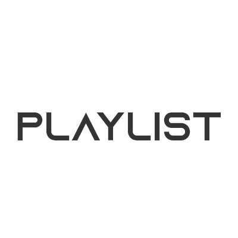

# Playlist - muzikos transliavimo platforma.

Šioje muzikos transliavimo platformoje bus galima klausytis muzikos per naršyklę. 

## Vartotojų rolės
* **User**
* **Artist**

## Numatomas funkcionalumas
* Vartotojų registracija bei prisjungimas.
* Muzikos pridėjimas į platformą (*Artist*).
* Pridėtos muzikos informacijos redagavimas (*Artist*).
* Pridėtos muzikos panaikimas iš platformos (*Artist*).
* Puslapiuojamas, filtruojamas pridėtos muzikos sąrašas(*Artist*).
* Puslapiuojamas, filtruojamas naujausios muzikos sąrašas(*User* & *Artist*).
* Puslapiuojamas, filtruojamas populiariausios muzikos sąrašas(*User* & *Artist*).
* Muzikos grojaraščio kūrimas. (*User* & *Artist*).
* Muzikos grojaraščio pavadinimo redagavimas. (*User* & *Artist*).
* Muzikos grojaraščio šalinimas. (*User* & *Artist*).
* Muzikos pridėjimas į grojaraštį (*User* & *Artist*).
* Pridėtos muzikos šalinimas iš grojaraščio (*User* & *Artist*).
